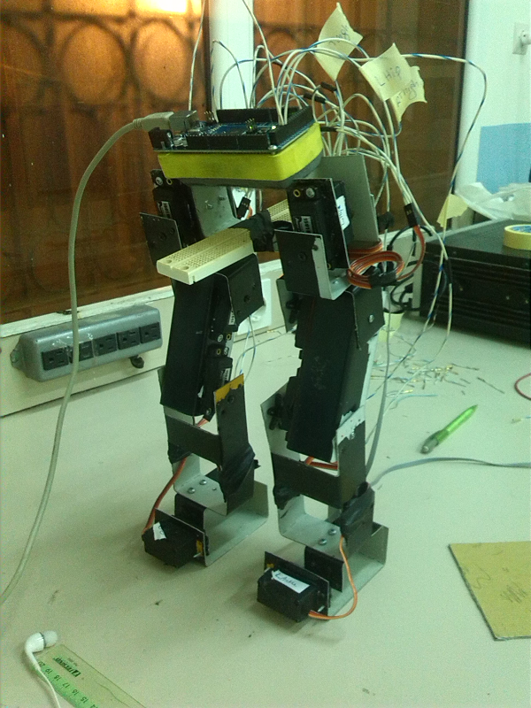

# Humanoid_Biped_Robot

This repo includes the code to have a static walk on a Arduino-controlled Humanoid Biped Robot, and an additional code to get the skeleton of a human body using the Kinect 3D sensor camera.

## Description:

The frame of the Biped robot was built using 1mm aluminum sheets. 

The controller used to control the robot is Arduino Mega, and the code used is found in the repo under the name of *BipedRobotAlgorithm.ino*.

A future implementation of the robot would include the use of a 3D sensor camera (we used the Kinect 3D sensor camer), in order to get the input of the motion of the robot from the motion of the human body's skeleton and then the robot can make the right move. A trial implementation of the receiving the human skeleton was done using Processing and Kinect. The code that was used in Processing is included in the repo under the name of *Kinect_SkeletonDisplay_winSDK.pde*.

In the first implementation the robot was wired to a laboratory power supply. So the electrical circuit of the robot included the Arduino Mega board, the 8 servo motors, and the power supply.
A future implementation of the robot may  include the use of battery to supply the energy to the robot.

For the motion of the robot, eight servo motors were used, because we have eight degrees of freedom in our robot. The servo motors are digital and they provide feedback of their position, which is used in the algorithm to control the motion of the robot.

you can check the [briefing video][2] to see the implemented biped robot and its real motion

you can also check the simulation of the static walk of the robot in this [simulation-link][1]

### Note
We would accept all feedback and would soon release our second version with more features :)

## Further resources
[Briefing video][2] and 
[Simulation video][1]

[1]: https://www.youtube.com/watch?v=R89XYS8xPj4 "Title"
[2]: https://www.youtube.com/watch?v=surk5Gd7MbY "Title"
